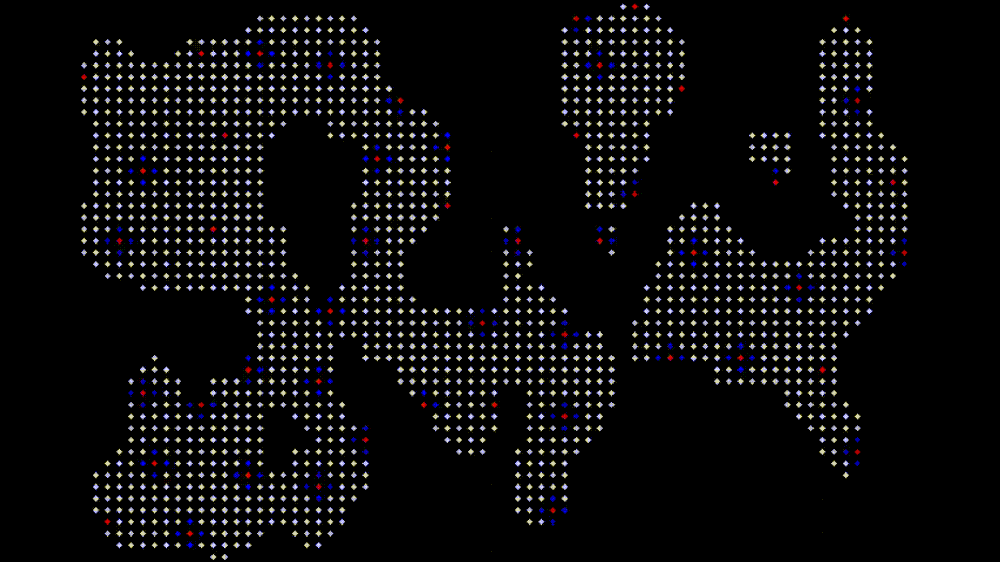

# Procedural-Risk
A procedural map generation in OpenCV for Risk-like tabletop games.

I developed this program to learn different algorithms as I thought of what it was going to be.

## Summary of the methods used
This implementation for procedural political map uses:

1. Random mask generation by smoothing a noise image
2. Poisson disk placement for the capitals
3. Region growing with a random factor for organic looking countries
